# Машинное зрение для распознавания штрих-кодов

Этот проект захватывает видеопоток с веб‑камеры, находит штрих-коды на кадрах и выводит информацию о распознанном коде и его типе.

---

## 📂 Структура проекта

```
├── main.py            # Основной скрипт для захвата и обработки видео
├── requirements.txt   # Зависимости проекта
├── settings.py        # Настраивается источник видеопотока
└── screenshots/       # Папка с примерами работы (17 изображений)
    ├── screenshot1.jpg
    ├── screenshot2.jpg
    ├── screenshot3.jpg
    ├── screenshot4.jpg
    ├── screenshot5.jpg
    ├── screenshot6.jpg
    ├── screenshot7.jpg
    ├── screenshot8.jpg
    ├── screenshot9.jpg
    ├── screenshot10.jpg
    └── screenshot11.jpg
    └── ....
```

## 🛠 Установка

1. Клонируйте репозиторий:

   ```bash
   git clone https://github.com/Obozhglas/barcodedetecter.git
   cd barcodedetecter
   ```
2. Создайте виртуальное окружение и установите зависимости:

   ```bash
   python3 -m venv venv
   source venv/bin/activate  # Linux/Mac
   venv\\Scripts\\activate   # Windows
   pip install -r requirements.txt
   ```

> **Требования:** Python 3.7+, OpenCV, PyZbar, NumPy

## 🚀 Запуск

```bash
python main.py
```

* Откроется окно с видеопотоком с веб‑камеры (1080p, 30 FPS) (в моем случае).
* В терминале появляются лог‑сообщения о найденных штрих‑кодах и их типах.
* Для остановки нажмите `Ctrl+C` или закройте окно.


## ⚙️ Описание работы кода

1. **Инициализация камеры**: `cap = cv2.VideoCapture(CAMERA)`. Если устройство не открыто, выводится сообщение об ошибке и выполнение завершается.
2. **Чтение кадров**: в цикле `while True` считывается кадр через `ret, frame = cap.read()`. При `ret=False` цикл прерывается.
3. **Предобработка изображения**:

   * Конвертация в оттенки серого: `cv2.cvtColor(frame, cv2.COLOR_BGR2GRAY)`.
   * Усиление контраста: `cv2.equalizeHist(frame)`.
4. **Детекция штрих-кодов**: `detectedBarcodes = decode(frame)` (pyzbar).
5. **Визуализация и логирование**:

   * По точкам `barcode.polygon` строится полилиния через `cv2.polylines` и прямоугольник через `cv2.rectangle`.
   * В лог выводятся значения `barcode.data.decode('utf-8')` и тип `barcode.type`.
6. **Обработка отсутствия кодов**: флаг `not_found_logged` предотвращает многократное логирование сообщения "Штрихкод не был найден".
7. **Отображение результата**: `cv2.imshow("Barcode Scanner", frame)` показывает обработанный кадр.
8. **Завершение работы**: при нажатии `q` или `ESC` выполняются `cap.release()` и `cv2.destroyAllWindows()`.

* Откроется окно с видеопотоком с веб‑камеры (1080p, 30 FPS).
* В терминале появляются лог‑сообщения о найденных штрих‑кодах и их типах.
* Для остановки нажмите `Ctrl+C` или закройте окно.

---

## 📸 Примеры работы

Ниже приведены 11 скриншотов, иллюстрирующих работу алгоритма в разных условиях (освещение, фон, расстояние).

<p align="center">
  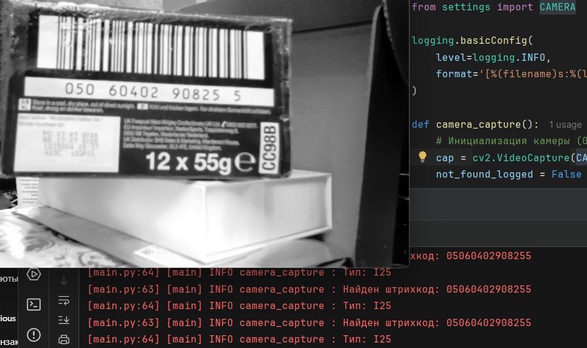
  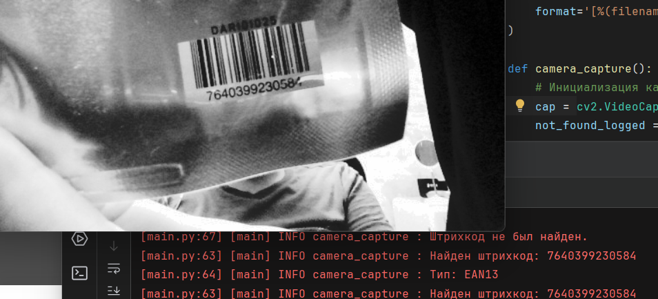
</p>
<p align="center>
  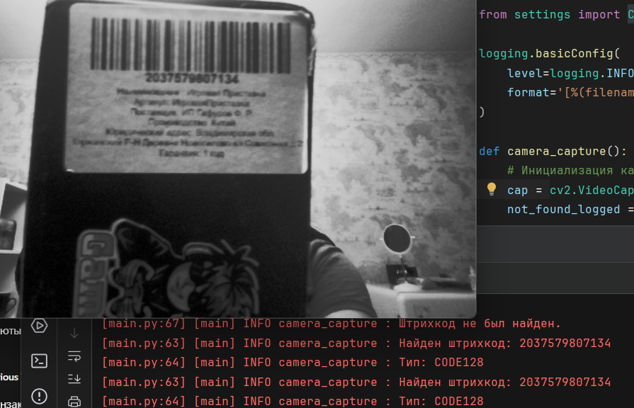
  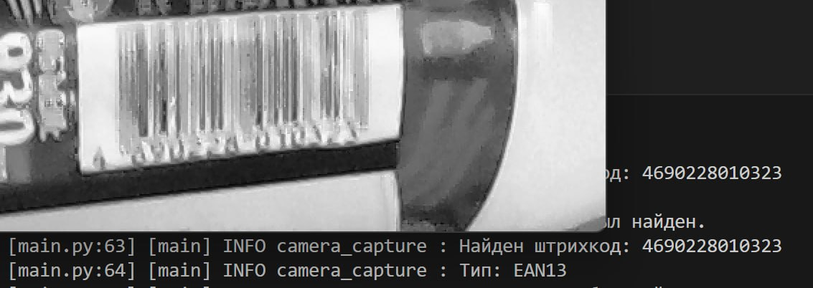
</p>
<p align="center">
  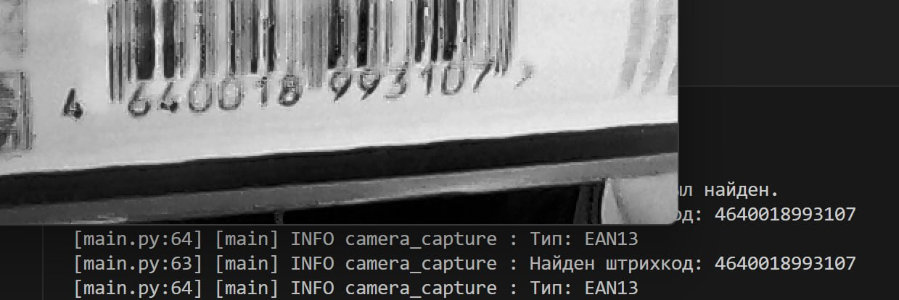
  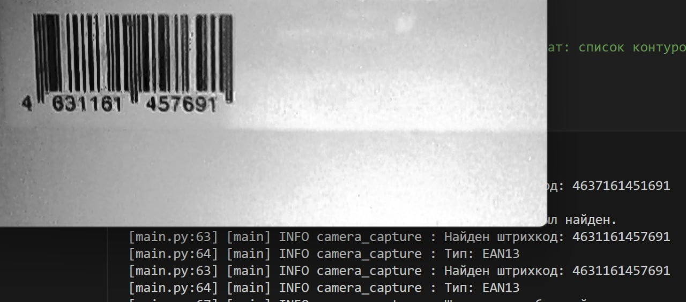
</p>
<p align="center>
  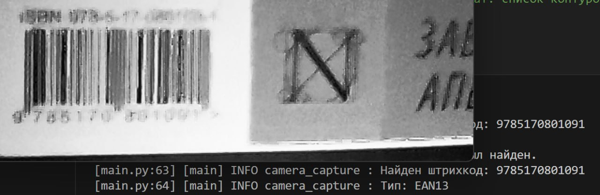
  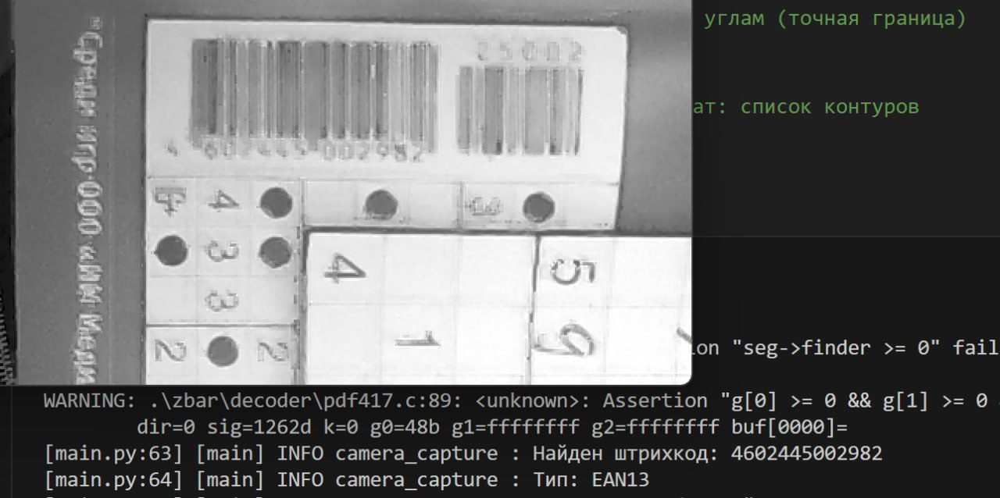
</p>
<p align="center">
  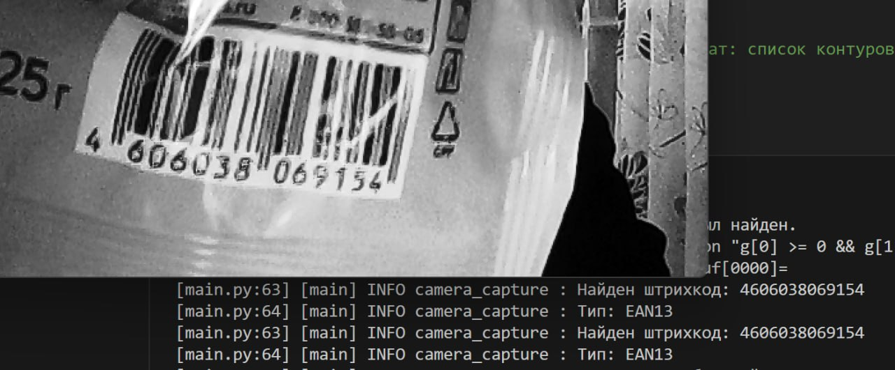
  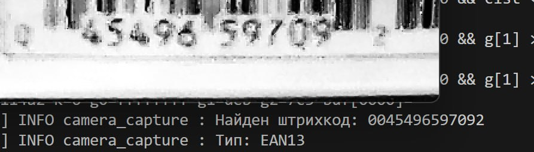
  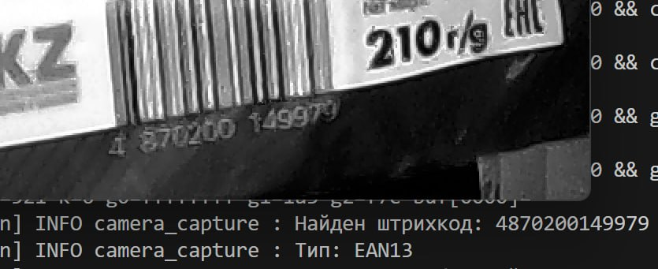
</p>

---

## 🔄 Тестирование углов поворота

Проведено исследование влияния угла поворота штрих-кода относительно осей камеры:

* При повороте на небольшой угол (до 15°) считывание поддерживается.
* При повороте на угол > 15° считывание не происходит.
* Чем ближе штрих-код к центральной оси X и Y кадра, тем выше вероятность успешного считывания.

Ниже приведены скриншоты для углов поворота:

<p align="center">
  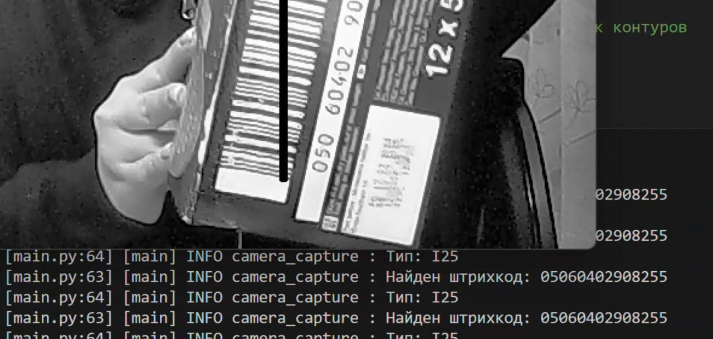
  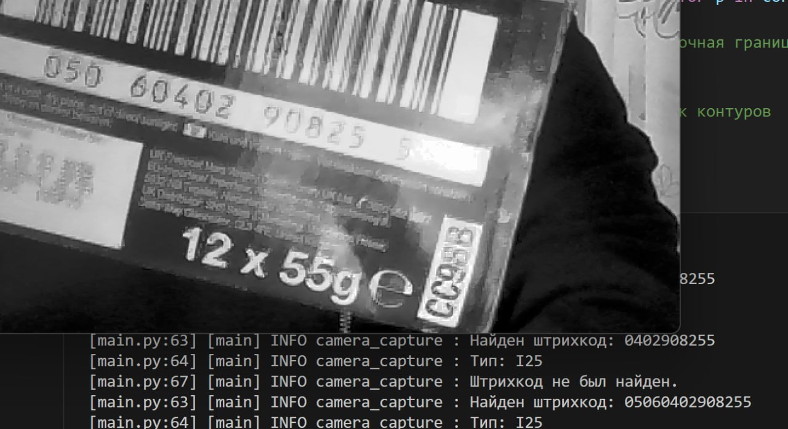
</p>

## ↔️ Тестирование при сохраненной горизонтали

Поворот в сторону с фиксированной горизонталью выдерживает хорошо, до момента поворота более чем на 40 градусов:

1. Фото 0 градусов
2. Фото со смещением на 37 градусов (наблюдаются ошибки в записи)

Ниже скриншоты:

<p align="center">
  
  
</p>

## ↕️ Тестирование ориентации предмета без изменения положения штрих-кода

Лучше всего поддерживает считывание штрихкода при изменении положения предмета из горизонтального в вертикальное без изменения положения самого штрих-кода (остается горизонтальным). Считывает штрих код практически при полном повороте (\~до 80 градусов)

<p align="center">
  
  
</p>

---

## 📑 Зависимости

```text
pyzbar
opencv-python
numpy
```

---
